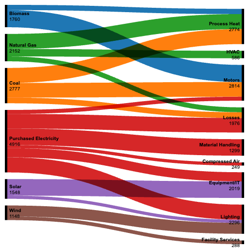

# Advanced Data Visualization: Sankey Diagram (RAWGraphs)

**Company:** Beahan Group  
**Use case:** Energy consumption flow from sources to end uses in manufacturing  
**Author email:** 23f3004490@ds.study.iitm.ac.in

## Files
- `chart.png` — Sankey diagram exported from RAWGraphs (required dimension: 512×512 px or smaller, recommended **512×512**).

- `energy_flows.csv` — Data used in RAWGraphs (18 rows).

## RAWGraphs Steps (exact mapping)

1. Open https://rawgraphs.io/ (or the RAWGraphs app).
2. **Load data** → Paste the contents of `energy_flows.csv`.
3. **Choose chart** → *Sankey Diagram*.
4. **Map dimensions:**
   - **Source** → `source`
   - **Target** → `target`
   - **Weight/Size** → `flow`
   - **Color** (optional but recommended) → `source` (gives exec-friendly grouping)
5. **Chart options (styling):**
   - Label: enable node labels, truncate at 18–22 chars if needed.
   - Links opacity: 0.6–0.8 for contrast.
   - Node width: medium.
   - Node padding: medium.
   - Color palette: use a muted categorical palette; keep losses in a neutral/darker tone.
   - Sort: by total descending (helps executives scan major uses first).
6. **Export** → PNG → set **width=512 px, height=512 px** → download as `chart.png`.

## Notes for the Annual Report / Board Deck
- Use succinct node labels (e.g., "Purchased Electricity", "Process Heat").
- Keep background **white**; ensure WCAG-friendly contrast.
- Consider annotating top 3 flows in the deck (not on the RAWGraphs image) to avoid clutter.

## How to get the *raw* GitHub URL for `README.md`
1. Push this folder to a GitHub repo (e.g., `beahan-sankey-rawgraphs`).
2. Open `README.md` on GitHub and click **Raw**.
3. Copy the URL shown in the address bar — it will look like:
   `https://raw.githubusercontent.com/<your-username>/<your-repo>/main/README.md`

> **Reminder:** validators often require **exactly** 512×512 px. If your portal complains, re-export in RAWGraphs at 512×512.
